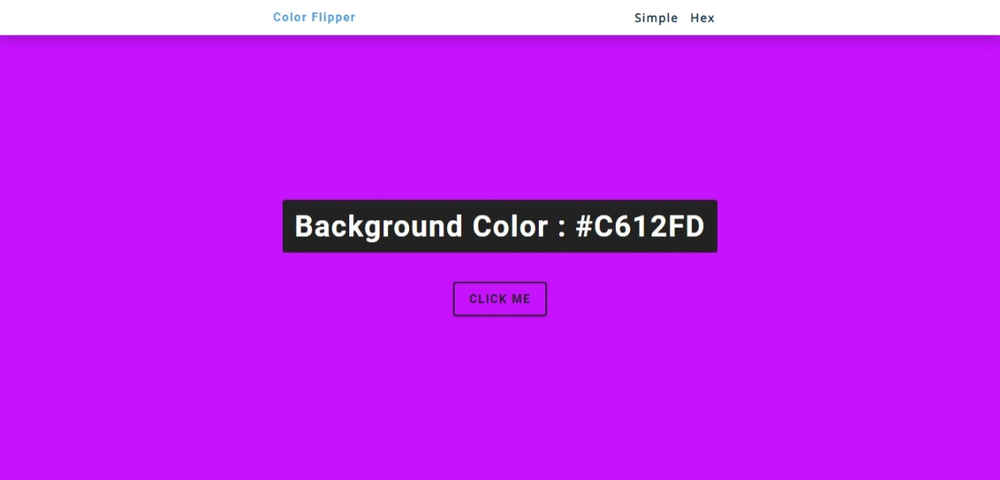
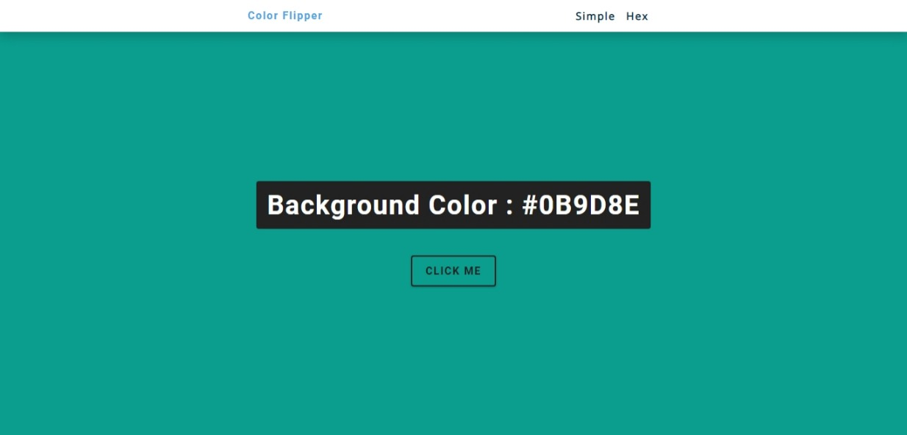
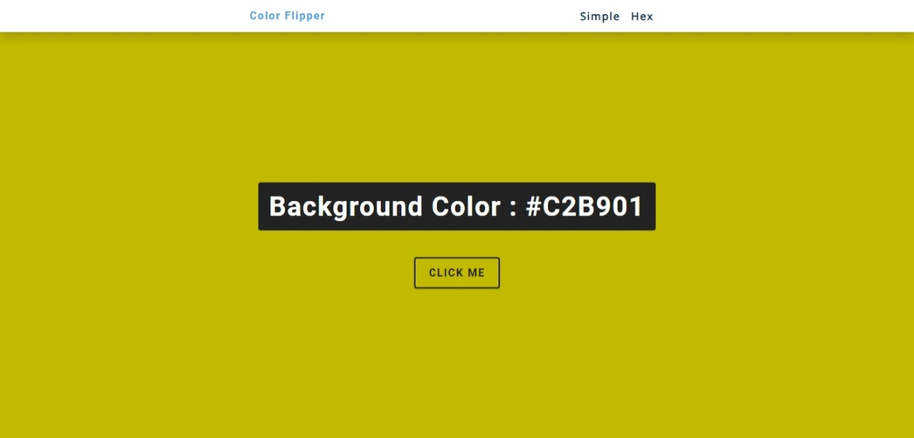
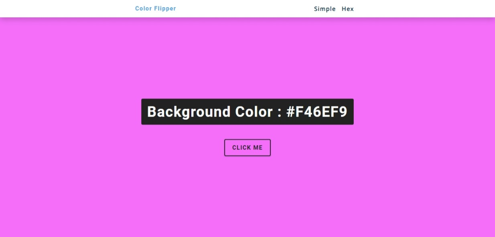

<h1 align="center"> Colour_flipper  </h1> 
<!-- ALL-CONTRIBUTORS-BADGE:START - Do not remove or modify this section -->
<!-- ALL-CONTRIBUTORS-BADGE:END -->
 
<h2 align="center">

</h2>

## Description
This is a simple website which displays background colour according to their hexadecimal values in CSS or simply by their names.

## Images

## Deployment
The website is deployed at  
<ul>https://vipulraj-123.github.io/Colour_flipper/</ul>
